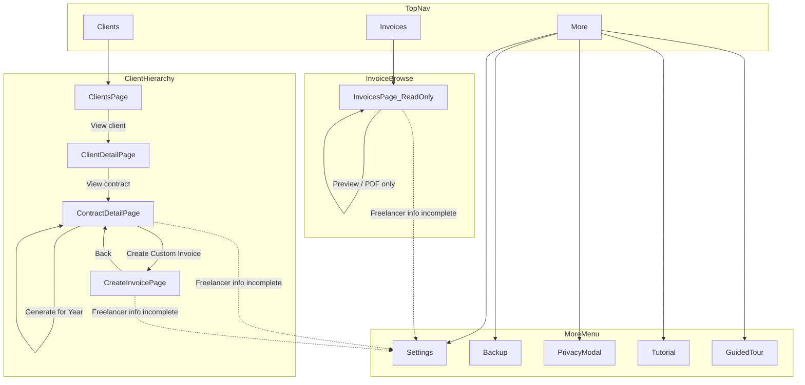
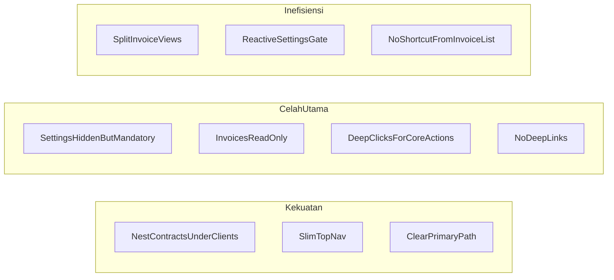

# Analisis Struktur Menu & Flow Navigasi (Saat Ini)

Dokumen ini mendeskripsikan struktur menu, alur navigasi, celah UX, dan inefisiensi flow myInvoice setelah simplification UX (branch `simplify/ux-navigation`).

---

## 1. Struktur Menu

### Top navigation (terlihat user)

| Level | Item | Tipe | File |
|-------|------|------|------|
| Primary | **Clients** | Halaman | `src/App.tsx` |
| Primary | **Invoices** | Halaman | `src/App.tsx` |
| Secondary | **More** (dropdown) | Menu | `src/App.tsx` |
| More → | Settings | Halaman | `src/features/settings/SettingsPage.tsx` |
| More → | Backup | Halaman | `src/features/backup/BackupPage.tsx` |
| More → | Privacy | Modal | `src/features/privacy/PrivacyPage.tsx` |
| More → | Tutorial | Overlay | `src/components/Tutorial.tsx` |
| More → | Guided Tour | Coachmark | `src/config/coachmarkSteps.ts` |
| Utility | Theme toggle | Aksi | `src/App.tsx` |
| Utility | Logo | → Clients | `src/App.tsx` |

### Halaman kontekstual (tidak ada di top nav)

| Page ID | Perlu context | Fungsi |
|---------|---------------|--------|
| `client-detail` | `clientId` | Detail client + CRUD kontrak |
| `contract-detail` | `contractId` | Detail kontrak + generate/hapus invoice |
| `create-invoice` | `clientId?`, `contractId?` | Form custom invoice |

Semua page didefinisikan di `PAGE_VALUES` (`src/App.tsx`). **Tidak ada React Router** — navigasi via state `currentPage` + `contextClientId` / `contextContractId`.

---

## 2. Diagram Flow Menu



---

## 3. Flow Operasional Utama

### A. Setup pertama kali (ideal path)

```
More → Settings (freelancer info wajib: name, address, email)
  → Clients (tambah client)
    → Client Detail (tambah contract)
      → Contract Detail (Generate for Year / Create Custom Invoice)
        → Preview / Download PDF
```

### B. Browse invoice (path alternatif)

```
Invoices → search/filter → Preview / PDF
(tidak bisa create, generate, atau delete dari sini)
```

### C. Backup

```
More → Backup → Export / Import JSON
```

---

## 4. Perilaku Navigasi Penting

- **Home default:** `clients` (`src/App.tsx`)
- **Active state Clients:** juga aktif saat `client-detail`, `contract-detail`, `create-invoice`
- **Klik top nav reset context:** `handlePageChange(page)` hanya kirim `page` — tidak kirim `clientId`/`contractId`. Klik "Clients" dari halaman detail akan reset context drill-down
- **Gate freelancer info:** wajib isi name + address + email (`src/utils/freelancerInfo.ts`) sebelum create/generate invoice atau PDF
- **Custom invoice entry point:** hanya dari Contract Detail — tidak ada tombol di Invoices atau Client Detail

---

## 5. Analisis: Celah (Gaps)

### Celah kritis

| # | Celah | Dampak |
|---|-------|--------|
| G1 | **Settings tersembunyi di More**, padahal wajib sebelum invoice | User baru bisa stuck: buat client/contract dulu, baru ditolak saat generate |
| G2 | **Invoices read-only** — tidak ada create/delete | User yang buka Invoices dulu tidak tahu harus balik ke Clients → Contract |
| G3 | **Custom invoice hanya dari contract** | Tidak bisa buat invoice ad-hoc tanpa contract (meski `CreateInvoicePage` mendukung tanpa contract) |
| G4 | **Tidak ada URL / browser back** | Tidak bisa bookmark halaman detail; refresh = kembali ke Clients |

### Celah sedang

| # | Celah | Dampak |
|---|-------|--------|
| G5 | **Klik nav "Clients" reset context drill-down** | User kehilangan posisi saat navigasi top-level |
| G6 | **Tidak ada onboarding otomatis** saat freelancer info kosong | Hanya alert + redirect reaktif, bukan proaktif saat app load |
| G7 | **Coachmark `settings-nav` ada di dropdown More** | Saat di halaman Settings, selector dropdown tidak visible — tour bisa gagal highlight |
| G8 | **Tutorial Step 1 = Settings, tapi home = Clients** | Urutan mental model vs default landing page tidak selaras |
| G9 | **Delete invoice hanya di Contract Detail** | Dari Invoices list tidak bisa hapus — asymmetry action |

### Celah ringan

| # | Celah | Dampak |
|---|-------|--------|
| G10 | Mobile: Tutorial ada di menu, theme hanya di header | Inkonsistensi penempatan utility |
| G11 | `Layout.tsx` legacy masih ada tapi tidak dipakai App | Dead code, bukan gap user-facing |
| G12 | Tidak ada indikator visual "setup incomplete" di home | User tidak tahu Settings belum lengkap sebelum coba invoice |

---

## 6. Analisis: Inefisiensi Flow

### Inefisiensi tinggi

| # | Inefisiensi | Klik minimum | Catatan |
|---|-------------|--------------|---------|
| I1 | **Generate recurring invoice** | 4+ klik | Clients → View → View → Generate for Year |
| I2 | **Custom invoice** | 4+ klik | Clients → View → View → Create Custom Invoice |
| I3 | **Split capability Invoices vs Contract Detail** | — | Dua tempat lihat invoice, kemampuan berbeda → cognitive load |
| I4 | **Settings gate reaktif (alert)** | +1 redirect | User isi form dulu, baru diberi tahu Settings wajib |

### Inefisiensi sedang

| # | Inefisiensi | Catatan |
|---|-------------|---------|
| I5 | **Duplikasi back navigation** | Contract Detail punya breadcrumb + tombol "Back to Client" — redundant tapi helpful |
| I6 | **Navigasi via CustomEvent + prop onNavigate** | Dua pola berbeda (`ClientsPage` vs `ClientDetailPage`) — maintenance overhead |
| I7 | **Invoices page panjang** | Recurring tabs + custom section + filter — banyak scroll untuk aksi sederhana (preview PDF) |
| I8 | **Tidak ada shortcut ke contract dari invoice row** | Dari Invoices, tidak bisa jump ke contract source |

### Yang sudah efisien (post-simplification)

- Menghapus global Contracts page — kontrak hanya di bawah client (mental model lebih jelas)
- Top nav 2 item utama — mengurangi noise vs versi lama (5+ item)
- More menu — Settings/Backup/help tidak mengganggu flow harian

---

## 7. Ringkasan Evaluasi



**Kesimpulan:** Struktur menu sudah lebih sederhana setelah simplification, tapi masih ada friction karena:

1. Aksi inti (generate/create) terkubur 3–4 level di bawah Clients
2. Invoices page dan Contract Detail punya peran overlap tapi tidak unified
3. Settings wajib tapi tidak prominent — celah onboarding

---

## 8. Rekomendasi Perbaikan (opsional)

Prioritas jika ingin lanjut perbaikan UX:

| Prioritas | Rekomendasi | Mengatasi |
|-----------|-------------|-----------|
| 1 | **Setup banner di Clients home** — tampilkan jika freelancer info belum lengkap, link ke Settings | G1, G6, G12 |
| 2 | **Quick action di Invoices** — tombol "Go to contract" per row | I8, G2 |
| 3 | **Unified invoice actions** — izinkan delete dari Invoices list | G9, I3 |
| 4 | **Preserve context on nav** — klik Clients dari detail kembali ke list, bukan reset | G5 |
| 5 | **First-run wizard** — redirect otomatis ke Settings jika belum setup (sekali) | G6, G8 |

---

*Terakhir diperbarui: branch `simplify/ux-navigation`*
